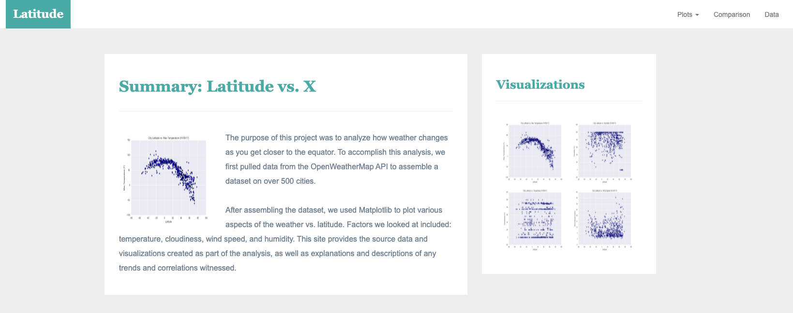
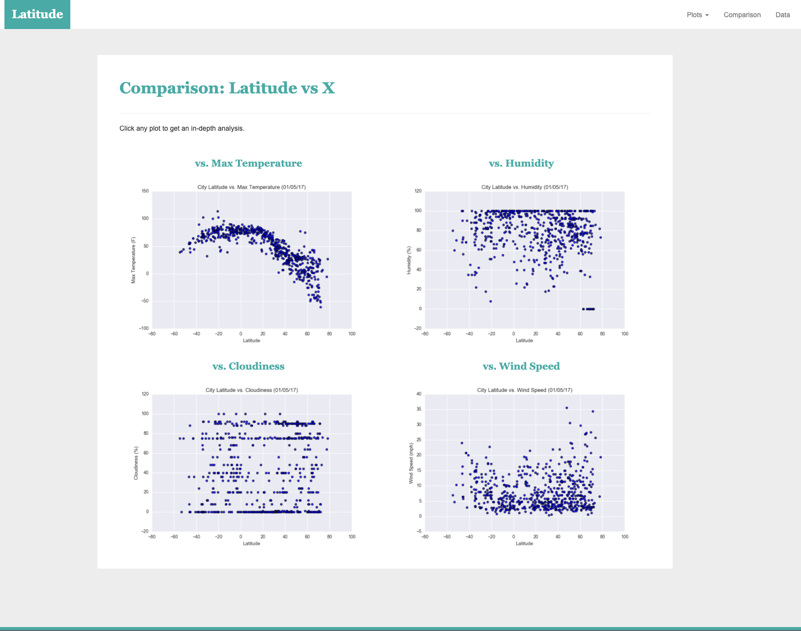

## Project Description

In this project, I created a visualization dashboard website for weather analysis that I previously did in the file "Resources/cities.csv".

In building this dashboard, I created individual pages for each plot and a means by which to navigate between them. These pages will contain the visualizations and their corresponding explanations. There is also have a landing page, a page where we can see a comparison of all of the plots, and another page where you can view the data I used to build them.

## Features & Libraries

* HTML
* CSS
* Bootstrap

## My Process

1. Build a landing page with the project explanation and links to other pages
2. Build four visualization pages with descriptive titles/headlines, visualizations themselves, and a description paragraph
3. Build a comparisons page that contains all the visualizations which uses a Bootstrap grid
4. Build a responsive data table with bootstrap component containing the data used in the visualizations
5. Add a dropdown menu with a navbar

## Screenshots

#### Landing page

Large screen:

Small screen:



#### Comparisons page

Large screen:

Small screen:

#### Data page

Large screen:

Small screen:

#### Visualization pages

You'll build four of these, one for each visualization. Here's an example of one:

Large screen:

Small screen:

#### Navigation menu

Large screen:

Small screen:

### Copyright

Trilogy Education Services © 2019. All Rights Reserved.
